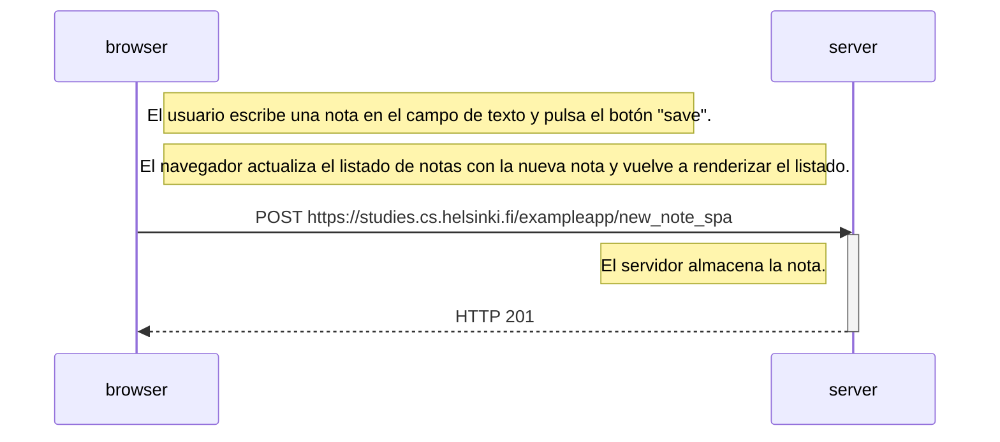

```mermaid
    sequenceDiagram
        participant browser
        participant server

        Note right of browser: El usuario escribe una nota en el campo de texto y pulsa el botón "save".
        Note right of browser: El navegador actualiza el listado de notas con la nueva nota y vuelve a renderizar el listado.

        browser->>server: POST https://studies.cs.helsinki.fi/exampleapp/new_note_spa
        activate server

        Note left of server: El servidor almacena la nota.

        server-->>browser: HTTP 201
        deactivate server


```